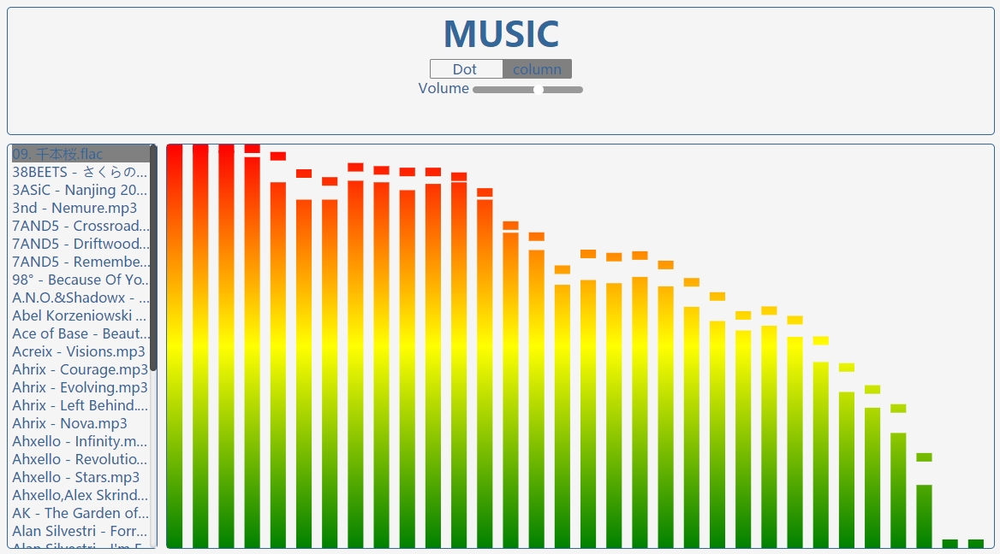
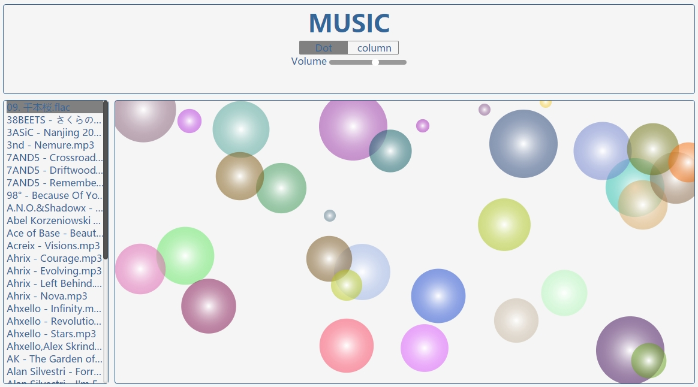
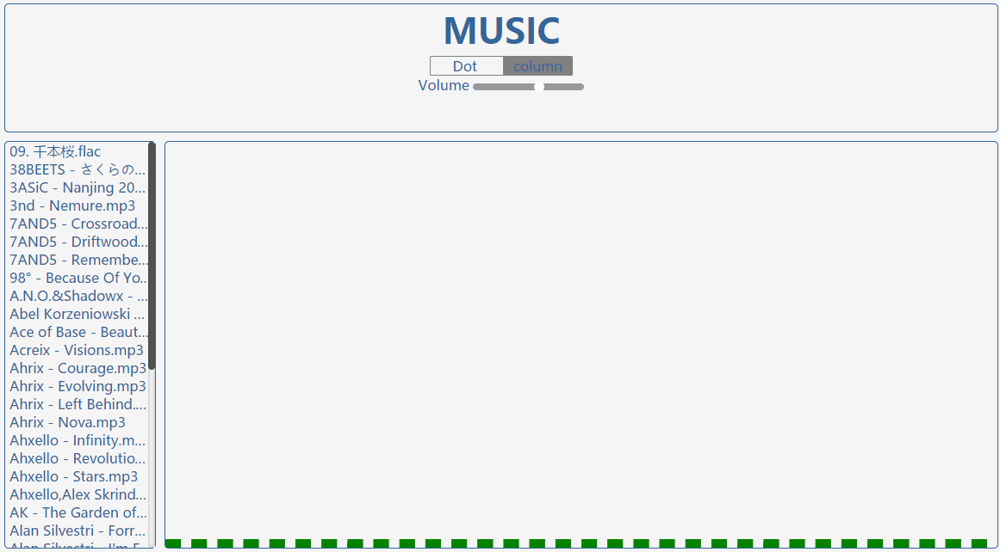

# canvas-music
***
NodeJS快速构建一个服务端，用CSS构建响应式前端界面，使用webAudio分析音频数据，利用Canvas可视化得到的数据.

**主页面：**

**canvas柱状展示：**

**canvas点状展示：**

**最后：**

**使用：**

	npm install  
	npm start  
**访问**  
[http://localhost:3000](http://localhost:3000)
